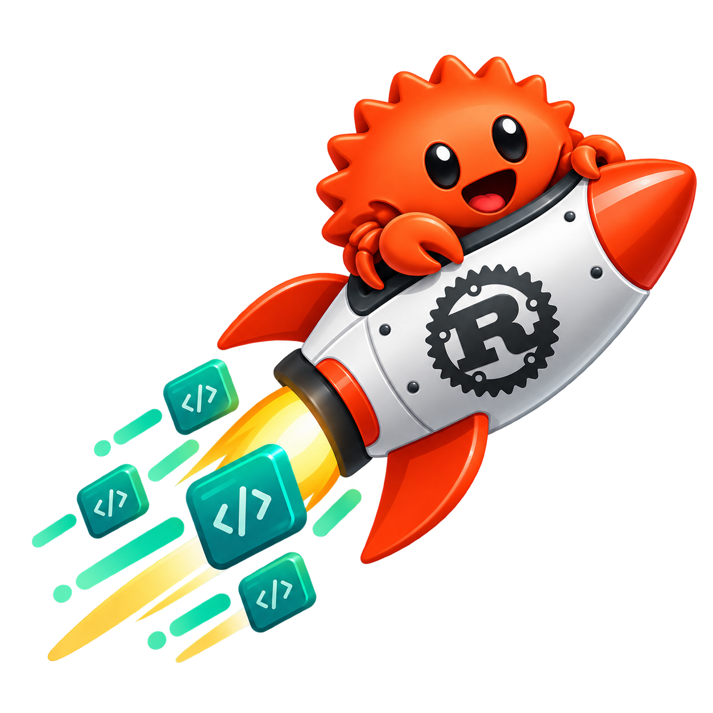

  

# Rucket 

A transport-agnostic Rust framework for moving structured data between embedded 
devices, desktops, and the web. Rucket turns raw byte streams from transports 
like UART, USB, BLE, TCP, or WebSockets into reliable, typed packets, while 
keeping framing, serialization, transport, and application logic cleanly separated. 
Designed for no_std embedded targets and full Rust applications alike, Rucket 
aims to provide one shared communication layer from microcontrollers and sensors 
all the way to desktop tools, servers, and browser clients.
